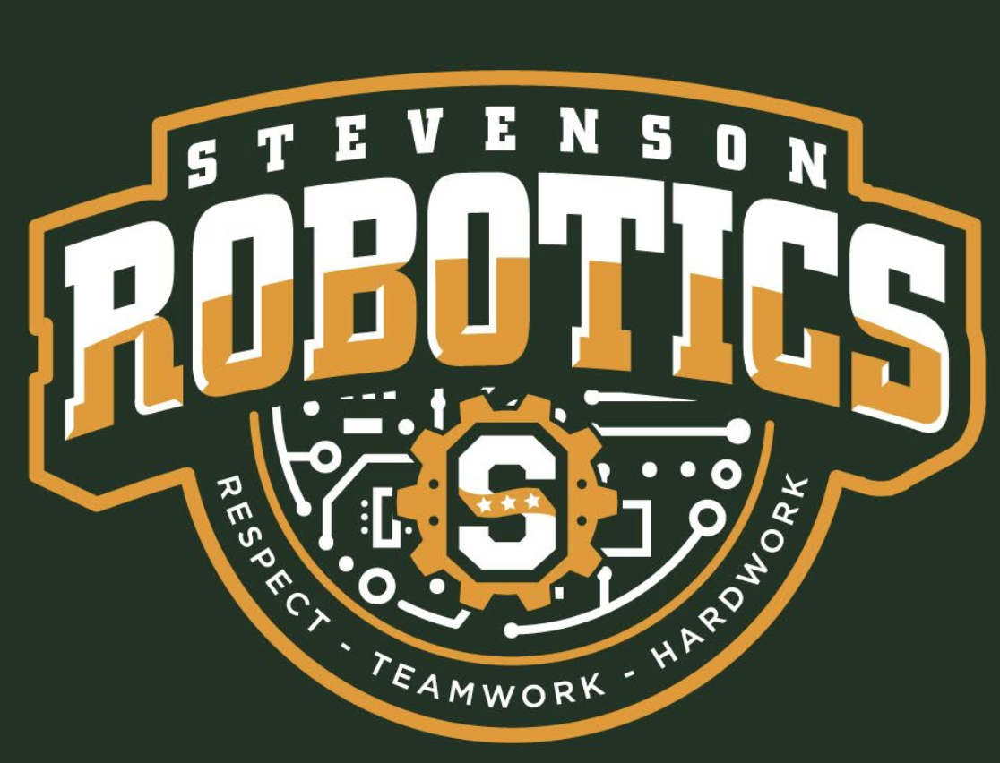

# **Steel Team 7**

Stevenson 1965Y 2019-2020

Competition styled for Vex EDR [Tower Takeover](https://www.vexrobotics.com/vexedr/competition/vrc-current-game "VEX Current Game"). Coded with [VEXCode V5 Text](https://www.vexrobotics.com/vexcode "VEXCode V5") in C++.
Find this code [here](https://www.github.com/IyadHamid/StevensonVex1965Y "Stevenson 1965Y Repository") on GitHub!

## **The Team:**

- Adam Taylor
- Andrei Nistor
- Iyad Hamid - *Primary Coder*
- Jonathan Burrer
- Joshua Neela
- Neil Thakker
- Tanmay Panchpor
	
## **Functionality**

- Basic controls
  - Tank and Arcade
- Displacement calculator
  - Found from basic drivetrain motor encoders
- Notification handler w/ multiple lcd support
  - Multiple lcd support
  - Modular/Copy & Pastable
- Realtime graphical variable controller
  - Change Arcade to Take in-game!
  - Multiple lcd support
  - Modular/Copy & Pastable
- All 5 Autonomous
- Vex-styled in-code documentation & format
  - Multi-file orginization

## **Robot Configuration**

|Name          | Type       | Port(s)  |
|:-------------|:-----------|:---------|
|Controller1   | controller |          |
|Controller2   | controller |          |
|topLeft       | motor      | 2        |
|bottomLeft    | motor      | 3        |
|topRight      | motor      | 10       |
|bottomRight   | motor      | 9        |
|intakeLeft    | motor      | 19       |
|intakeRight   | motor      | 20       |
|cubeLift      | motor      | 16       |
|intakeLift    | motor      | 17       |
|potentiometer | pot        | A        |

# *...because it "just works".*
